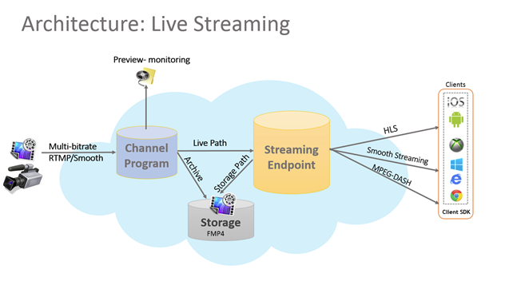
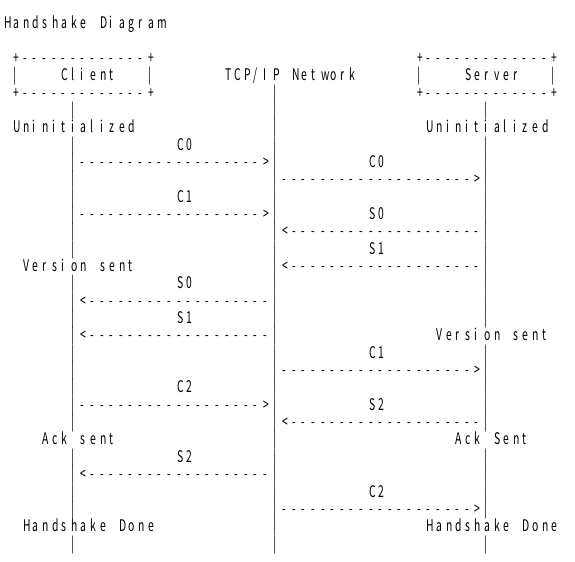
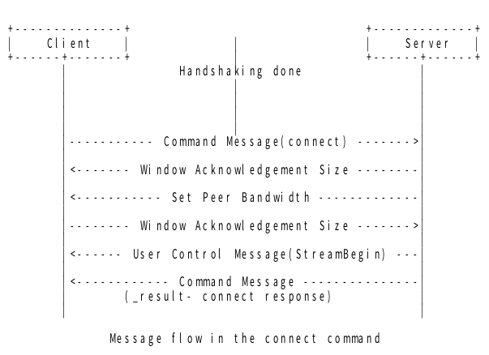
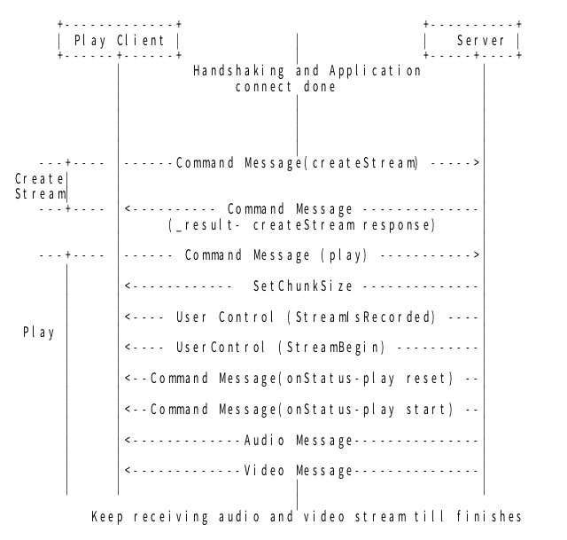
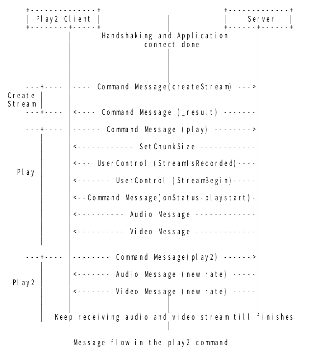
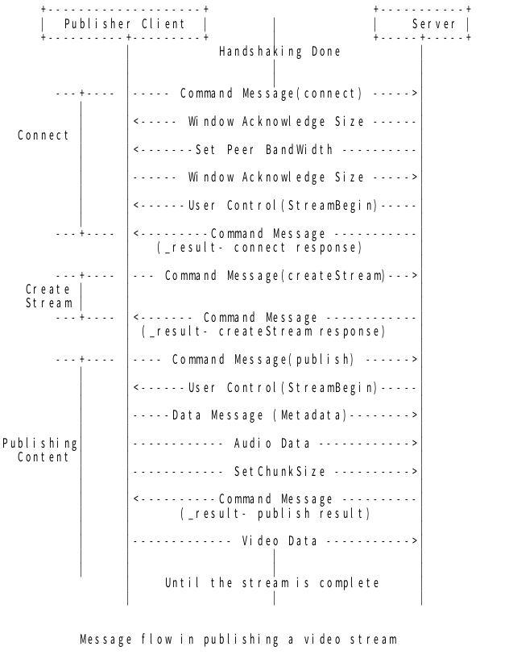
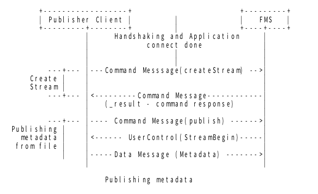

## RTMP 구현

### 목차
1. RTMP (리얼 타임 메시징 프로토콜(Real Time Messaging Protocol) 란?
2. RTMP 특징
3. RTMP Protocol 
4. RTMP Message sequence

### 1. RTMP (리얼 타임 메시징 프로토콜(Real Time Messaging Protocol) 란?

Adobe(Macromedia)에서 Flash player와 server 간의 오디오, 비디오 및 기타 데이터 스트리밍을 위해서 만들었습니다.
audio 전송 메시지, video 전송 메시지, command 메시지, shared object 전송 메시지, metadata 전송 메시지, user control 메시지로 이루어져 있습니다.
실시간 방송에서 전송규격으로 많이 사용된다고 합니다.
아프리카 TV, YouTube, Facebook live-video, AWS Elemental MediaLive, Twitch 등에서 사용된다고 합니다.



### 2. RTMP 특징

스트리밍 관련하여 
publish (라이브 방송) command,
play command, seek command, pause command
play2 command (play with new bitrate) 등의 명령어들이 규격에 포함되어있습니다. 
오디오, 비디오 및 기타 데이터를 chunk로 만들어서 전송할 수 있습니다.

규격 문서에는 protocol과 일부 command sequence flow가 포함되어있고, 서버나 클라이언트가 각 명령을 어떻게 구현할 지에 대한 내용은 포함되어있지 않습니다.

play 시에 bitrate를 변경 기능 구현의 경우, 서버에 서로 다른 bitrate로 인코딩 된 비디오 파일 3-4개를 저장해두고, 클라이언트가 bitrate 변경 play를 요청하면 스트리밍 중에 다른 bitrate를 가진 파일을 스트리밍하는 방식으로 구현한다고 합니다.

### 3. RTMP Protocol 

https://www.adobe.com/devnet/rtmp.html
adobe가 2012년에 1.0 규격문서를 release 하였습니다. 완전한 버전은 아니라고 하는데, 이 문서 이후에 release 된 문서는 없는 것 같습니다.

RTMP 종류 :

기본 RTMP 이외에 여러 종이 있습니다. 
RTMP와 RTMPS 가 주로 사용되는 것 같습니다.

RTMP (기본): TCP, 1935번 포트 사용합니다.
RTMPT (RTMP Tunneled): RTMP 데이터를 HTTP로 감싼 것
RTMPS (RTMP Secure): RTMP 데이터를 HTTPS로 감싼 것
RTMPE (Encrypted RTMP): 128비트로 암호화된 RTMP
RTMPTE (Encrypted RTMP Tunneled): RTMPT, RTMPE 섞어 놓은 형태
RTMFP (Real Time Media Flow Protocol): UDP에서 동작.항상 암호화 된 상태로 데이터 전송

#### RTMP 구조 :

문서에서는 RTMP Chunk Stream 과 RTMP를 구분해서 이야기하고 있고, protocol format 이 다르기 때문에 다른 용도로 이용되는 것으로 예상을 했지만, 어떻게 구분하는지, 언제 어떤 것을 이용하는 것인지 파악하지 못했습니다.
nginx 등에서는 chunk stream 기반의 RTMP 프로토콜을 구현하고 있습니다.

접속 후, 서버와 클라이언트 간에 handshake protocol 교환이 일어나고, 
성공하면 rtmp chunk stream 기반의 통신이 이루어집니다.

##### Handshake Format : 

클라이언트는 c0 , c1을 보냅니다.
클라이언트는 s0, s1 을 받으면, c2를 보냅니다.
클라이언트가 s2를 받으면 handshake 과정을 끝내고 chunk stream 을 보냅니다.

서버는 c0,c1을 받으면, s0,s1을 보냅니다.
서버는 c1을 받으면, s2를 보냅니다.
서버가 c2를 받으면 handshake 과정이 끝내고 데이터를 받습니다.

즉, 클라이언트는 c1 의 응답인 s2 를 받으면 handshake를 끝내고
서버는 s1의 응답인 c2 를 받으면 handshake를 끝냅니다.

```puml
title : client #1
client -> server : c0
client -> server : c1
server -> client : s2
client -> server : chunk stream
```
```puml
title : client #2
client <- server : s0
client <- server : s1
client -> server : c2
```

```puml
title : server #1
client -> server : c0
client <- server : s0
client <- server : s1

client -> server : c1
client <- server : s2
```

```puml
title : server #2
client -> server : c2
client -> server : chunk stream
```

```puml
client -> network : c0
network -> server : c0
activate server
client -> network : c1
server -> network : s0
server -> network : s1
deactivate server
network -> client : s0
network -> client : s1
activate client
network -> server : c1
activate server
client -> network : c2
deactivate client
server -> network : s2
deactivate server
network -> client : s2
activate client
network -> server : c2
activate server
client -> network : chunk
deactivate client
network -> server : chunk
deactivate server
```


c0값으로 rtmp protocol version 을 보냅니다. ffmpeg 의 경우 3을 version값으로 보냅니다.

c1에는 앞으로의 시간의 epoch 가 되는 시간값과 random값(1528byte)을 보냅니다. ffmpeg 의 경우 시간 epoch 값으로 0을 사용합니다.

reandom값이 들어갑니다.
c1의 응답인 s2 에는 c1의 random 값이 들어갑니다.

s1의 응답인 c2 에는 s1의 reandom 값이 들어갑니다.

Handshake for client : C0(1 byte), C1(1536 byte), C2(1536 byte)
Handshake for server : S0(1 byte), S1(1536 byte), S2(1536 byte)

CO(1 byte) : 
C1(1536 byte) : time(4 byte) zero(4 byte) randomByte(1528 byte)
SO(1 byte) : 
S1(1536 byte) : time(4 byte) zero(4 byte) randomByte(1528 byte)
C2(1536byte) : time(4 byte) time(4 byte) randomByteOfS1(1528 byte)
S2(1536byte) : time(4 byte) time(4 byte) randomByteOfC1(1528 byte)

RandomByte can be : key(764byte) digest(764byte)

##### RTMP Chunk Stream Format :

ChunkStream : ChunkHeader ChunkData
ChunkHeader : BasicHeader MessageHeader ExtendedTimestamp
BasicHeader(1b or 2b or 3b) : ChunkType(1b) ChunckStreamID(0b or 1b or 2b)
ChunkType0_MessageHeader(11b): Timestamp(3b) MessageLength(3b) MessageTypeId(1b) MessageStreamId(4b)
ChunkType1_MessageHeader(7b): TimestampDelta(3b) MessageLength(3b) MessageTypeId(1b) 
ChunkType2_MessageHeader(3b) : TimestampDelta(3b)
ChunkType3_MessageHeader(0) : NULL

ChunkType 0 Header : 11 byte
1. chunk stream 의 제일 처음에 사용됩니다.
2. stream 의 timestamp 가 뒤로 갈 때 사용됩니다. (예를 들어 backward seek 때문에)

ChunkType 1 Header: 7 byte
1. message stream id 가 생략됩니다. 
2. message length, message type 은 다르고, message stream id 는 이전 chunk 의 것과 같은 경우에 사용됩니다.

ChunkType 2 Header: 3 byte
1. message length, message type, message stream id 와  가 생략됩니다. 이전 chunk 와 같은 length, type, id 를 갖는 경우에 사용됩니다.

ChunkType 3 Header: 0 byte
1. 따로 추가 header 정보가 없습니다. 이전 stream 과 모든 정보가 같은 경우에 사용됩니다.

##### two examples in spec 
1. chunck size 보다 작은 같은 length, type 의 message 를 보내는 경우

|  | message stream id | message type | time | length |
|----|-------------------|--------------|------|--------|
|msg1| 12345 | 8 | 1000 | 32 |
|msg2| 12345 | 8 | 1020 | 32 |
|msg3| 12345 | 8 | 1040 | 32 |
|msg4| 12345 | 8 | 1060 | 32 |

---->
chunk
|  | chunk id | chunk type | data | payload length |
|----|----------|------------|------|----------------------|
|chunk1 | 3 | 0 | delta:1000, msg_length:32, msg_type:8, msg_stream id : 12345 | 32 |
|chunk2 | 3 | 2 | delta:20 | 32 |
|chunk3 | 3 | 3 |  | 32 |
|chunk4 | 3 | 3 |  | 32 |

2. chunck size (128 byte) 를 넘는 크기의 message 를 보내는 경우

|  | message stream id | message type | time | length |
|----|-------------------|--------------|------|--------|
|msg1| 12345 | 9 | 1000 | 307 |

---->
chunk
|  | chunk id | chunk type | data | payload length |
|----|----------|------------|------|----------------------|
|chunk1 | 3 | 0 | delta:1000, msg_length:307, msg_type:9, msg_stream id : 12345 | 128 |
|chunk2 | 3 | 3 |  | 128 |
|chunk3 | 3 | 3 |  | 51 |


##### RTMP Message Format :

Message : MessageHeader(11b) Payload
MessageHeader : MesageTypeId(1b) PayloadLength(3b) Timestamp(4b) MessageStreamId(3b)

##### messageTypeId 에 사용되는 값의 예: 
- 0x01 = Set Chunk Size Message
- 0x02 = Abort Message
- 0x03 = Acknowledgement Message
- 0x04 = User control Message ( StreamBegin, StreamEOF, PingReuest, PingResponse,  etc.)
- 0x05 = Window Acknowledgement Size Message
- 0x06 = Set Peer Bandwidth Message
- 0x08 = Audio Data
- 0x09 = Video Data
- 0x0F(15) = AMF3 type Data Message (Metadata, etc.)
- 0x10(16) = AMF3 type Shared object Message
- 0x11(17) = AMF3 type command Message
- 0x12(18) = AMF0 type Data Message (Metadata, etc.)
- 0x13(19) = AMF0 type Shared object Message
- 0x14(20) = AMF0 type command Message
- 0x16(22) = Aggregate Message

##### Protocol Control Message :
Set Chunk Size, Abort Message, Acknowledgement Message, Window Acknowledgement Size Message 은 control message 라고 합니다.
ChunkStreamId:2로 MessageStreamId:0 으로 정해져있습니다.
해당 message 의 경우, ChunkData 에 들어가는 값에 대한 설명은 규격에 정해져있습니다.

##### User Control Message : messageTypeId : 4
ChunkStreamId:2로 MessageStreamId:0 으로 정해져있습니다.

##### RTMP Command Message : messageTypeId : 20, 17
AMF 규격을 사용합니다.
AMF type Message의 경우 CommandName, TransactionID, Parameter 등의 정보가 payload 에 AFM 규격에 따라 인코딩되어서 들어갑니다.

##### Data Message : messageTypeId : 15, 18
Metadata, user data 를 보낼 때 사용합니다.
AMF 규격을 사용합니다.

##### AMF규격 (AMF0, AMF3 규격) : 
ActionMessageFormat:Adobe Actionscript Object serialization 규격, string, number, obejct(=struct)를 serialize 하기위한 규격입니다.

##### MessageStreamId 의 값:
RTMP ChunkStream Format에 들어갈 때는 little-endian order 입니다.
RTMP Message Format에 들어갈 때는 big-endian order 입니다.

##### Wireshark RTMP 지원:
RTMP : 지원되는 것 같습니다. 전부 지원하는 것 같지는 않음. parsing 을 제대로 못하는 경우가 있음
AMF : 지원되는 것 같습니다. parsing 을 제대로 못하는 경우가 있는 것으로 보임

### 4. RTMP Message sequence

RTMP 통신은 다음과 같은 sequence 로 진행됩니다.

#### Play, Play2
1. TCP connect
2. Handshake
3. Connect 
4. CreateStream 
5. Play 
6. Audio / Video Data 
7. Play2
8. Audio / Video Data 
7. CloseStream 

#### Publish recorded video
1. TCP connect
2. Handshake
3. Connect 
4. CreateStream 
5. Publish
6. Audio / Video Data 
7. CloseStream 

#### Publish metadata from recorded stream  
1. TCP connect
2. Handshake
3. Connect 
4. CreateStream
5. Publish 
6. Metadata Data
7. CloseStream 

#### BroadCast a shared object 
1. TCP connect
2. Handshake
3. Connect 
4. Shared object event

### RTMP 상세 message sequence :

#### Handshake


#### Connect


#### Play, Play2


#### Play2


#### Publish recorded video


#### Publish metadata from recorded stream  



