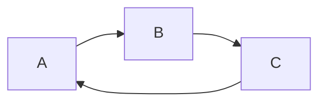
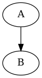

```sequence {theme=""}
A -> B : hello
```

```puml
Alice -> Bob: Authentication Request
...
|||
Bob --> Alice: Authentication Response
...5 minutes latter...
||100||
Bob --> Alice: Bye !
```

```puml
participant User
User -> A: DoWork
activate A #FFBBBB
A -> B: << createRequest >>
activate B
B -> C: DoWork
activate C  #DarkSalmon
C --> B: WorkDone
destroy C
B --> A: RequestCreated
deactivate B
A -> User: Done
deactivate A

create Bob
C -> Bob : new Bob
create Alice
C -> Alice : new Alice
Bob -> Alice : hello
create Other
Alice -> Other : new
create control String
Alice -> String
note right : You can also put notes!
Alice --> Bob : ok
```

```puml

```


```puml {theme=""}
title Authentication Sequence

Alice->Bob: Authentication Request
note right of Bob: Bob thinks about it
Bob->Alice: Authentication Response

note over A,B: text1
note left of A: text2
note right of A
    multiline
    text
end note

note over A,B: text1
note left of A: text2
note right of A
    multiline
    text
end note

[->A: text
A->]: text


loop text
    A->B: text
end

opt text
    A->B: text
end

```

```puml
[->A: text
A->]: text
```

```puml
A->ref over B
end ref -> A
```

```puml
 Add text to the side of the diagram by
 indenting it with a space.

A->B: Wow!
```

```flow
st=>start: Start :> http://www.google.com[blank]
e=>end:  End :>  http://www.google.com
op1=>operation: My Operation
sub1=>subroutine: My Subroutine
cond=>condition: Yes
or No?:>http://www.google.com
io=>inputoutput: catch something...
para=>parallel: parallel tasks

st->op1->cond
cond(yes)->io->e
cond(no)->para
para(path1, bottom)->sub1(right)->op1
para(path2, top)->op1
```

```flow
st=>start
e=>end

st->e


```




```puml
A->B
```



```viz
digraph G {
  A-> B
  B-> C
  B-> D
}
```

```viz { engine="neato" }
digraph G {
  A-> B
  B-> C
  B-> D
}
```


```vega-lite
{
  "$schema": "https://vega.github.io/schema/vega-lite/v2.json",
  "data": {
    "values": [
      {"a":"A", "b":20},
      {"a":"B", "b":55},
      {"a":"C", "b":43}
    ]
  },
   
  "mark": "bar",
  "encoding": {
    "x": {"field": "a", "type": "ordinal"},
    "y": {"field": "b", "type": "quantitative"}
  },
  "width":500,
  "height":400
}
```
```viz{engine="fdp"}
digraph G {
start-> s1
s1 -> s2
}
```

```viz{engine=""}
digraph G {

	subgraph cluster_0 {
		style=filled;
		color=lightgrey;
		node [style=filled,color=grey];
		a0 -> a1 -> a2 -> a3;
		label = "process #1";
	}

	subgraph cluster_1 {
		node [style=filled];
		b0 -> b1 -> b2 -> b3;
		label = "process #2";
		color=blue
	}
	start -> a0;
	start -> b0;
	a1 -> b3;
	b2 -> a3;
	a3 -> a0;
	a3 -> end;
	b3 -> end;

	start [shape=Mdiamond];
	end [shape=Msquare];
}
```

```puml
actor Foo1
boundary Foo2
control Foo3
entity Foo4
database Foo5
collections Foo6
Foo1 -> Foo2 : To boundary
Foo1 -> Foo3 : To control
Foo1 -> Foo4 : To entity
Foo1 -> Foo5 : To database
Foo1 -> Foo6 : To collections
```

```puml
actor Bob #red
' The only difference between actor
'and participant is the drawing
participant Alice
participant "I have a really\nlong name" as L #99FF99
/' You can also declare:
participant L as "I have a really\nlong name" #99FF99
'/
Alice->Bob: Authentication Request
Bob->Alice: Authentication Response
Bob->L: Log transaction

Alice->Alice: This is a signal to self.\nIt also demonstrates\nmultiline \ntext

autonumber
Bob -> Alice : Authentication Request
Bob <- Alice : Authentication Response
Bob ->x Alice
Bob -> Alice
Bob ->> Alice
Bob -\ Alice
Bob \\- Alice
Bob //-- Alice
autonumber 15
Bob ->o Alice
Bob o\\-- Alice
autonumber 40 10
Bob <-> Alice
Bob <->o Alice
Bob -[#red]> Alice : hello
Alice -[#0000FF]->Bob : ok
```
```puml
autonumber "<b>[000]"
Bob -> Alice : Authentication Request
Bob <- Alice : Authentication Response
autonumber 15 "<b>(<u>##</u>)"
Bob -> Alice : Another authentication Request
Bob <- Alice : Another authentication Response
autonumber 40 10 "<font color=red><b>Message 0 "
Bob -> Alice : Yet another authentication Request
Bob <- Alice : Yet another authentication Response
```

```puml
autonumber 10 10 "<b>[000]"
Bob -> Alice : Authentication Request
Bob <- Alice : Authentication Response
autonumber stop
Bob -> Alice : dummy
autonumber resume "<font color=red><b>Message 0 "
Bob -> Alice : Yet another authentication Request
Bob <- Alice : Yet another authentication Response
autonumber stop
Bob -> Alice : dummy
autonumber resume 1 "<font color=blue><b>Message 0 "
Bob -> Alice : Yet another authentication Request
Bob <- Alice : Yet another authentication Response
```

```puml
Alice -> Bob : message 1
Alice -> Bob : message 2

newpage
Alice -> Bob : message 3
Alice -> Bob : message 4

newpage A title for the\nlast page
Alice -> Bob : message 5
Alice -> Bob : message 6
```


```puml
Alice -> Bob: Authentication Request
alt successful case
Bob -> Alice: Authentication Accepted
else some kind of failure
Bob -> Alice: Authentication Failure
group My own label
Alice -> Log : Log attack start
loop 1000 times
Alice -> Bob: DNS Attack
end
Alice -> Log : Log attack end
end
else Another type of failure
Bob -> Alice: Please repeat
end
```
```puml
Alice->Bob : hello
note left: this is a first note  
Bob->Alice : ok
note right: this is another note
Bob->Bob : I am thinking
note left
a note
can also be defined
on several lines
end note
```

```puml
participant Alice
participant Bob
note left of Alice #aqua
This is displayed
left of Alice.
end note
note right of Alice: This is displayed right of Alice.
note over Alice: This is displayed over Alice.
note over Alice, Bob #FFAAAA: This is displayed\n over Bob and Alice.
note over Bob, Alice
This is yet another
example of
a long note.
end note
```


